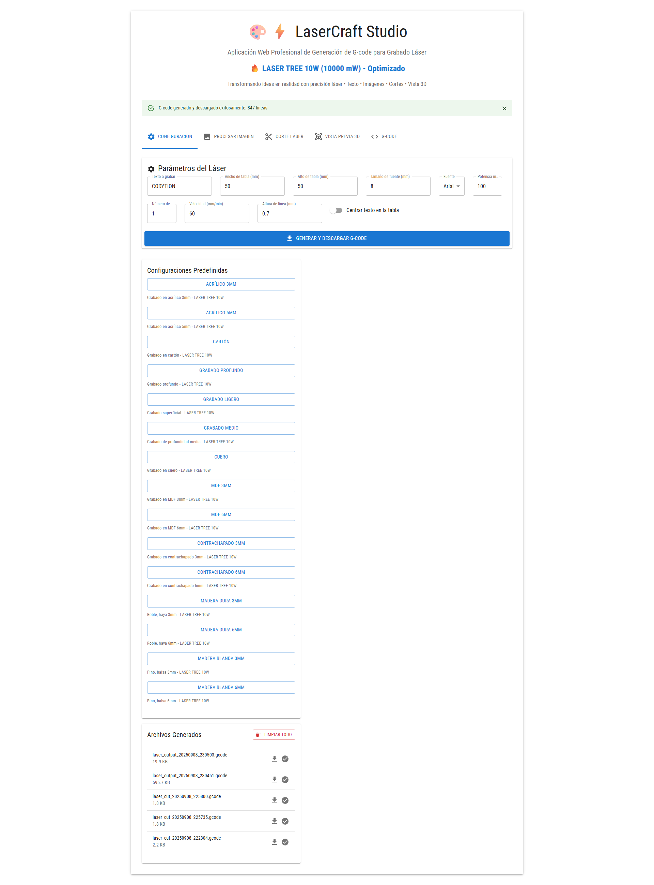
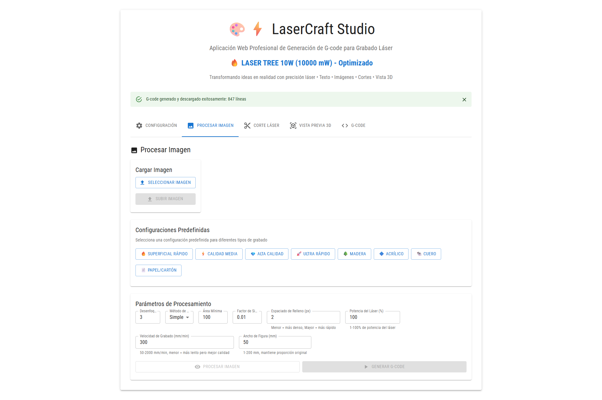
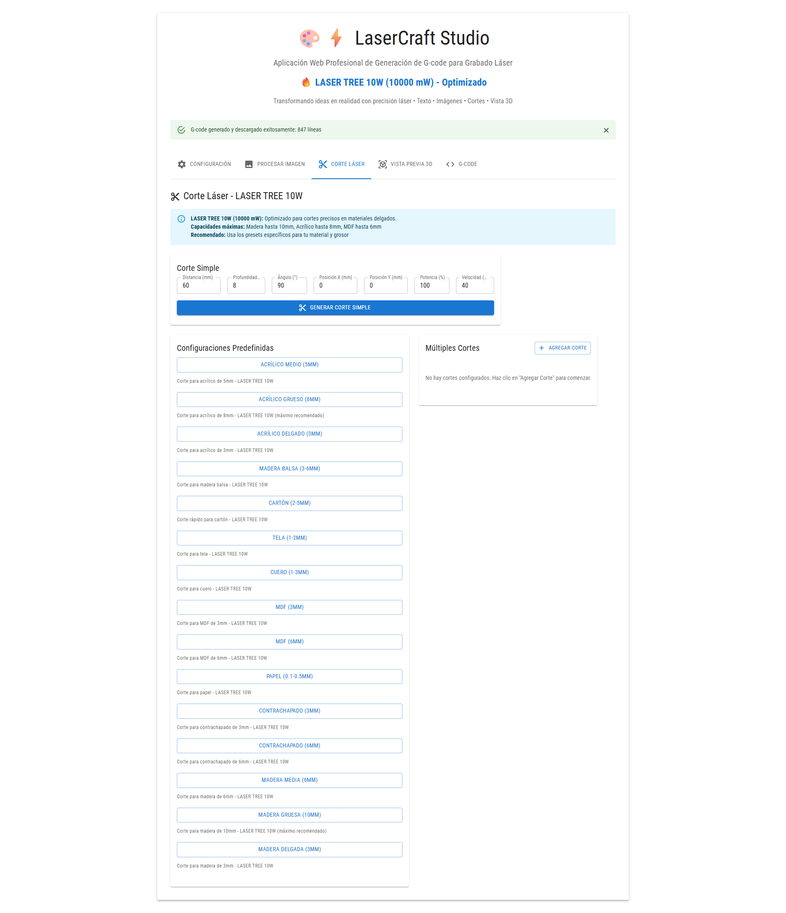

# 📚 Documentación Completa - LaserCraft Studio

Documentación completa y detallada para LaserCraft Studio, optimizada para LASER TREE 10W.

## 🎯 Índice de Documentación

### 🚀 Guías de Inicio
- **[Instalación](./INSTALLATION.md)** - Guía completa de instalación paso a paso
- **[Configuración Avanzada](./CONFIGURATION.md)** - Configuración optimizada para LASER TREE 10W
- **[API Reference](./API.md)** - Documentación completa de la API REST

### 🛠️ Solución de Problemas
- **[Troubleshooting](./TROUBLESHOOTING.md)** - Guía completa para resolver problemas comunes

### 🖼️ Recursos Visuales
- **[Imágenes](./images/)** - Capturas de pantalla y recursos visuales

## 🔥 Características Principales

### ✨ **Grabado de Texto Avanzado**
- 🎯 **Potencia optimizada** para LASER TREE 10W
- 📝 **Múltiples fuentes** (Arial, Times New Roman, Courier New)
- ⚙️ **Configuraciones predefinidas** para diferentes materiales
- 🎨 **Centrado automático** o posicionamiento manual

### 🖼️ **Procesamiento de Imágenes**
- 🖥️ **Vista previa en tiempo real** del procesamiento
- 🎛️ **Controles avanzados** de umbralización y simplificación
- 🔧 **Presets específicos** para diferentes materiales
- 📐 **Escalado automático** manteniendo proporciones

### ✂️ **Corte Láser Preciso**
- 📏 **Cortes simples y múltiples** con configuración individual
- 📐 **Ángulos personalizables** (0° a 360°)
- 🎯 **Profundidad configurable** con múltiples pasadas
- ⚡ **Presets optimizados** para cada material y grosor

### 🎮 **Vista Previa 3D**
- 🌐 **Visualización interactiva** del G-code generado
- 📊 **Representación realista** de las trayectorias del láser
- 🔍 **Zoom y rotación** para inspección detallada

## 🚀 Inicio Rápido

### 📋 Prerrequisitos
- **Python 3.8+**
- **Node.js 16+**
- **LASER TREE 10W** (o compatible)

### ⚡ Instalación en 3 pasos

```bash
# 1️⃣ Clonar el repositorio
git clone https://github.com/godie007/LaserCraft.git
cd LaserCraft

# 2️⃣ Instalar dependencias del backend
cd backend
pip install -r requirements.txt

# 3️⃣ Instalar dependencias del frontend
cd ../frontend
npm install
```

### 🎯 Ejecutar la aplicación

```bash
# Backend (Terminal 1)
cd backend
python app.py

# Frontend (Terminal 2)
cd frontend
npm run dev
```

**🌐 Abrir:** http://localhost:3000

## 🔧 Configuraciones Optimizadas

### 📊 Presets para LASER TREE 10W

| Material | Grosor | Potencia | Velocidad | Pasadas |
|----------|--------|----------|-----------|---------|
| **Madera Blanda** | 3mm | 80% | 150 mm/min | 3 |
| **Madera Blanda** | 6mm | 90% | 100 mm/min | 5 |
| **Madera Dura** | 3mm | 85% | 120 mm/min | 4 |
| **Acrílico** | 3mm | 80% | 100 mm/min | 2 |
| **Acrílico** | 5mm | 90% | 50 mm/min | 3 |
| **MDF** | 3mm | 75% | 150 mm/min | 2 |
| **MDF** | 6mm | 90% | 80 mm/min | 3 |

### ⚡ Capacidades Máximas
- **Madera:** Hasta 10mm
- **Acrílico:** Hasta 8mm  
- **MDF:** Hasta 6mm
- **Cartón:** Hasta 5mm
- **Cuero:** Hasta 3mm

## 🛠️ Tecnologías Utilizadas

### 🖥️ Frontend
- **React 18** - Framework principal
- **TypeScript** - Tipado estático
- **Material-UI** - Componentes de interfaz
- **Three.js** - Visualización 3D
- **Vite** - Build tool moderno

### ⚙️ Backend
- **Python 3.8+** - Lenguaje principal
- **Flask** - Framework web
- **OpenCV** - Procesamiento de imágenes
- **NumPy** - Cálculos matemáticos
- **Matplotlib** - Generación de gráficos

### 🔧 Herramientas
- **Git** - Control de versiones
- **ESLint** - Linting de código
- **Prettier** - Formateo de código

## 📚 Documentación Detallada

### 🚀 [Guía de Instalación](./INSTALLATION.md)
- Prerrequisitos del sistema
- Instalación paso a paso
- Configuración de entorno
- Verificación de instalación
- Solución de problemas de instalación

### ⚙️ [Configuración Avanzada](./CONFIGURATION.md)
- Parámetros de potencia optimizados
- Configuraciones por material
- Procesamiento de imágenes
- Configuración de corte láser
- Optimización de rendimiento
- Configuración de seguridad

### 🔧 [API Reference](./API.md)
- Endpoints completos
- Parámetros de request/response
- Códigos de estado HTTP
- Manejo de errores
- Ejemplos de uso en Python, JavaScript y cURL

### 🐛 [Troubleshooting](./TROUBLESHOOTING.md)
- Problemas de instalación
- Problemas de conexión
- Problemas de procesamiento
- Problemas de interfaz
- Debugging y logs
- Guía de soporte

## 🎨 Recursos Visuales

### 📸 Capturas de Pantalla

#### 🏠 Pantalla Principal

*Interfaz principal con todas las funcionalidades disponibles*

#### ⚙️ Configuración de Grabado

*Panel de configuración con presets optimizados para LASER TREE 10W*

#### 🖼️ Procesamiento de Imágenes

*Herramientas avanzadas de procesamiento de imágenes*

## 🤝 Contribuir

¡Las contribuciones son bienvenidas! Por favor:

1. 🍴 Fork el proyecto
2. 🌿 Crea una rama para tu feature (`git checkout -b feature/AmazingFeature`)
3. 💾 Commit tus cambios (`git commit -m 'Add some AmazingFeature'`)
4. 📤 Push a la rama (`git push origin feature/AmazingFeature`)
5. 🔄 Abre un Pull Request

## 📄 Licencia

Este proyecto está bajo la Licencia MIT. Ver [LICENSE](../LICENSE) para más detalles.

## 👨‍💻 Autor

**Diego** - [@godie007](https://github.com/godie007)

## 🙏 Agradecimientos

- **LASER TREE** por el excelente láser de 10W
- **Comunidad Open Source** por las librerías utilizadas
- **Contribuidores** que ayudan a mejorar el proyecto

---

<div align="center">

**⭐ Si te gusta este proyecto, ¡dale una estrella! ⭐**

[](https://github.com/godie007/LaserCraft/stargazers)
[](https://github.com/godie007/LaserCraft/network)

</div>